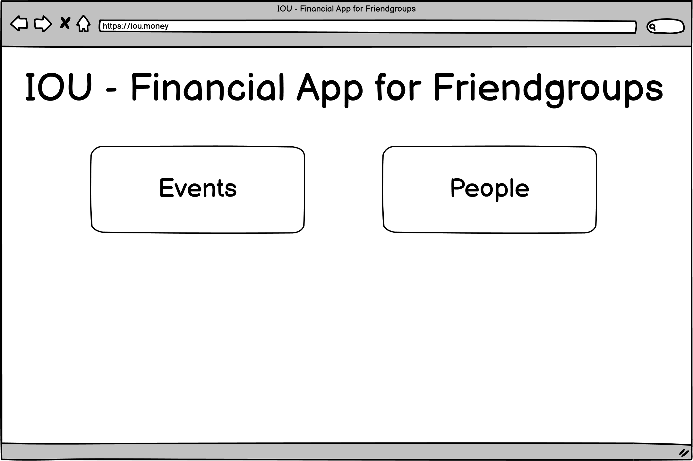
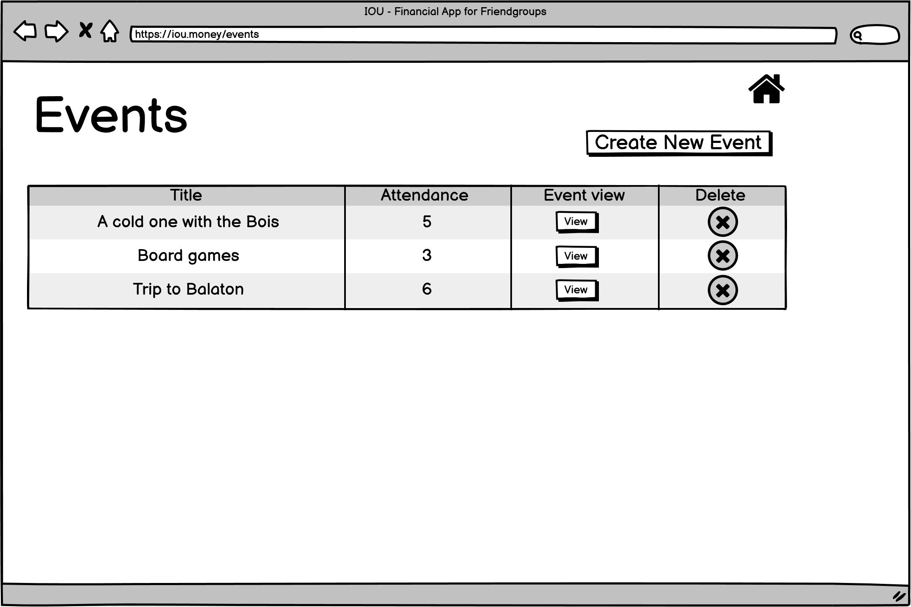
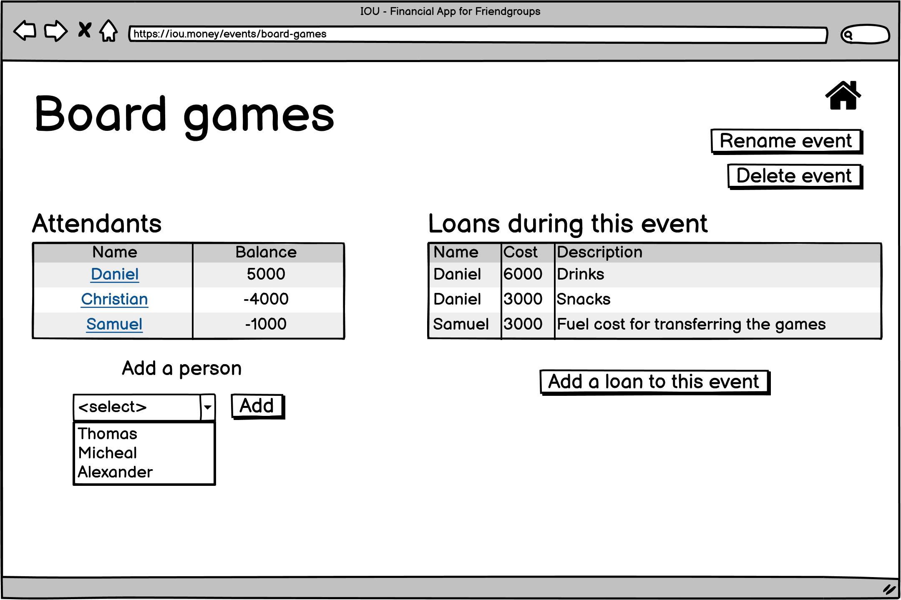
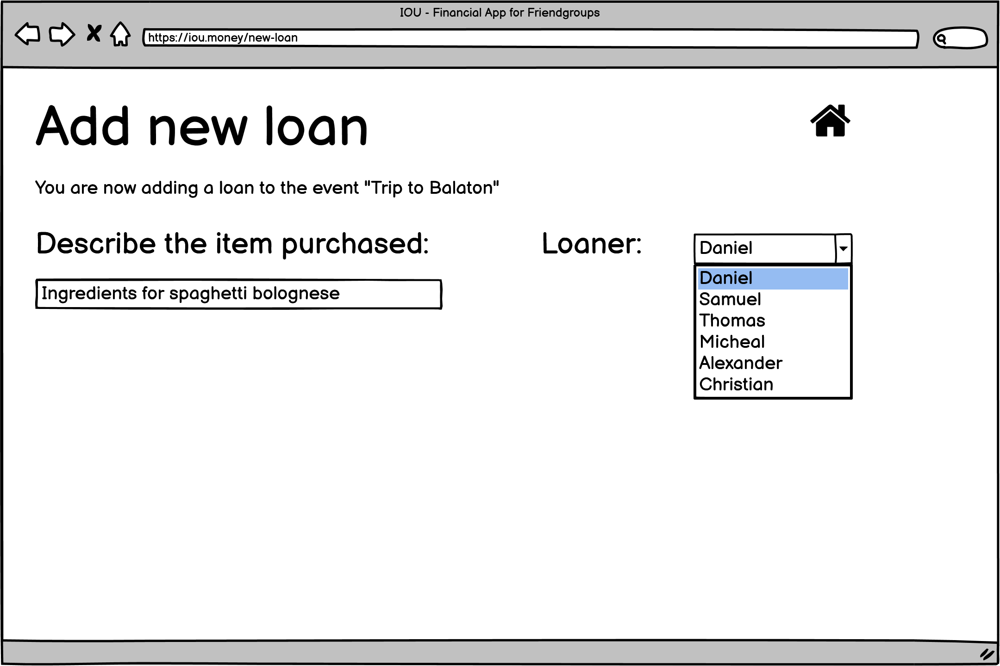
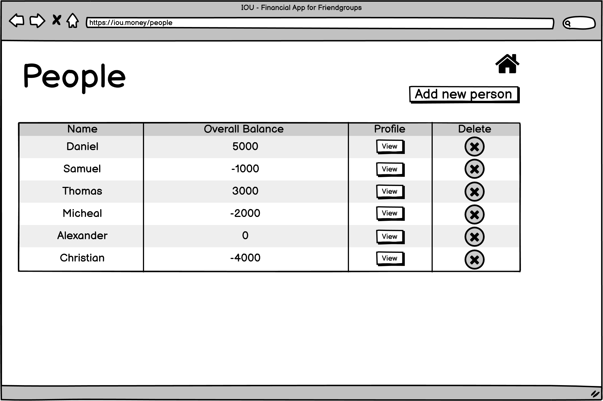
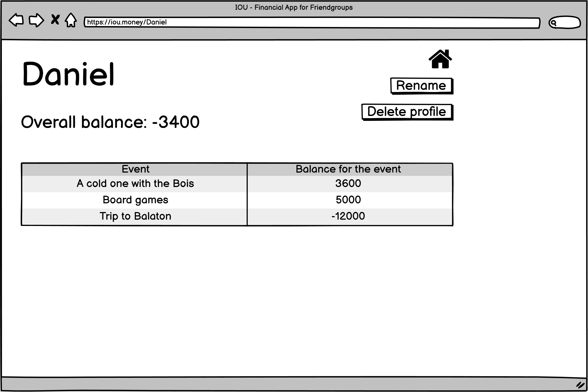

---
title: "IOU: Specification (Course: VITMAV42, Server Side Javascript)"
author: [Daniel Arany, A65BYS]
date: "INSERT_DATE_HERE"
...

# IOU: A Group Finance Tracking Application

## Short description
This application aims to help a group of friends manage their common finances. For example, if someone buys lunch for everyone, than that expenditure can be written up for that person. The cost then will be evenly distributed among the peaple at that gathering, which makes paying back easier and less maths-heavy.

This description will only describe a minimal version of the application. Expanding with other functions will be possible.

## Entities

### Event
**Events** can be listed, modified, created or deleted. They can relate to multiple **loans**, but an event can exist without it being linked to any **loans**. An event also relates to at least two **people**, otherwise it does not make sense to hold an event (0 people) or track finances (1 person).

Features:

- Name
- Number of **people** attending

### Loan
A **loan** should be created when a **person** buys something for all the **people** in an event. **Loans** must relate to one and only one event and person. **Loans** can also be created or deleted, they can be listed by **event** or **people**.

Features:

- Amount
- Description

### Person
A **person** can exist without any **events** or **loans**. A **person** can be created or destroyed and added to an event.

Features:

- Name
- Overall balance (not a meaningful financial information, but rather a "score" of how well someone pays their debts)

## Usage

An average usecase for this app will follow these steps:

| Happens in real life | Happens in the application | Maths |
| ----------- | ----------- | ----------- |
| The Person **A**, **B** and **C** organizes a cookout | An event is created, with Persons **A**, **B** and **C** ||
| Person **A** buys the food for **x** amount | A loan is added with Person **A** attached for **x** amount | Persons **B** and **C** owe **x/3** amount each, while **A** has a balance of **2x/3** |
| Person **B** buys the drinks for **y** amount |  A loan is added with Person **B** attached for **y** amount | Balances after this step: **A**: **2x/3 - y/3**, **B**: **x/3 + 2y/3**, **C**: **x/3 - y/3** |
| The party concludes, everyone puts in or takes out the money they owe or are owed from a common pot | The event can be deleted | |

## Web GUI

All CRUD operations can be done on the **people** and **event** entities.

When the user first enters the site, the landing page is shown.

From there, the user can select to go to the page where the events are listed.

Events can be created with the _Create New Event_ button. After giving it a name a new event is ready, people and loans needs to be added separately. Viewing a single event takes the user to the following page.

This is where loans and people can be added to an event.

There is a home icon in the upper-right corner of every page, which takes the user back to the landing page. From there the user can navigate to the page where all the profiles are displayed. It is possible to view or delete profiles from this page.

The profile of a single person can also be checked with the following view.

